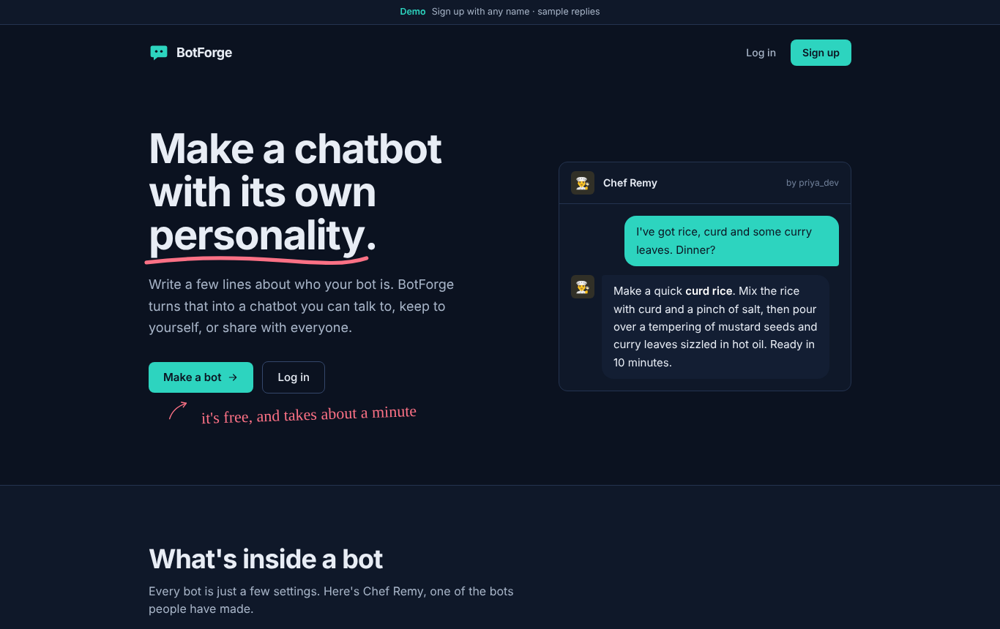
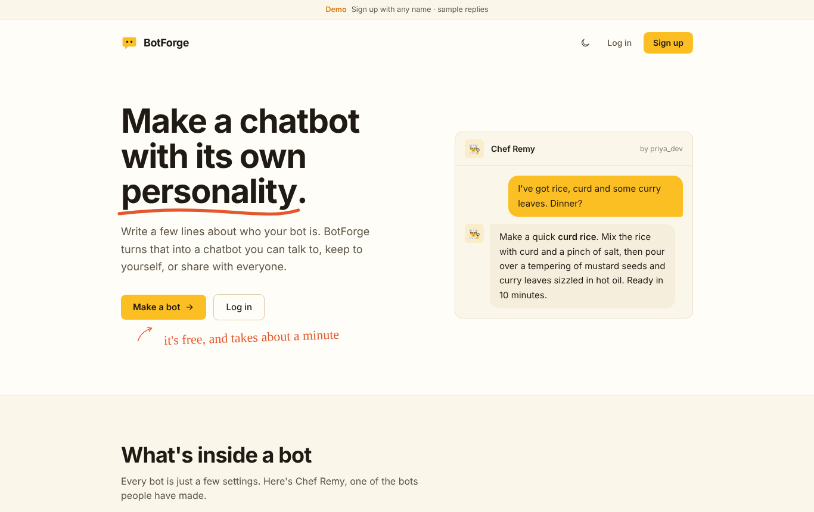
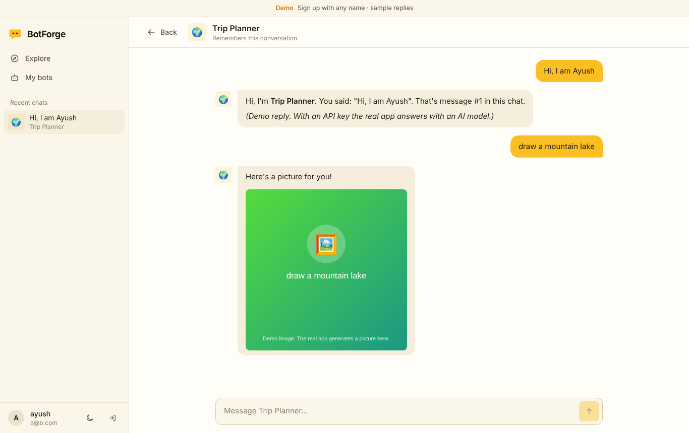
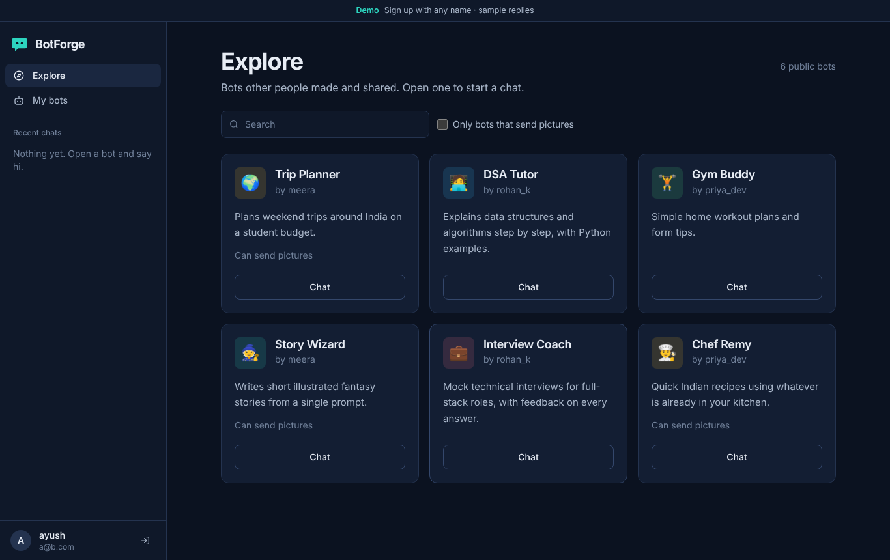
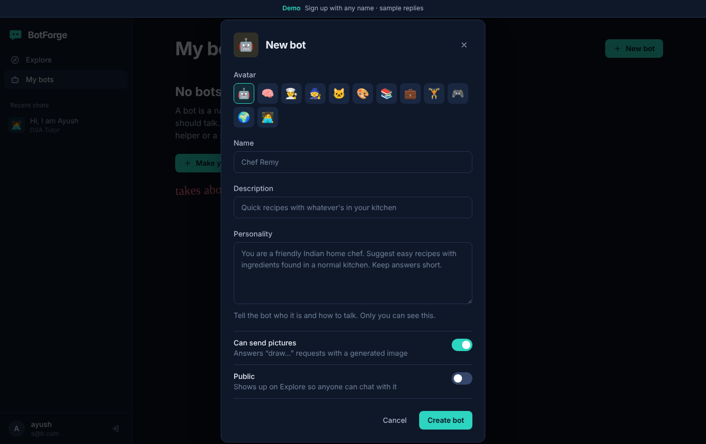

# BotForge: AI Chatbot Platform

A full-stack web app where users create their own AI chatbots, give each one a personality, and chat with them. Bots can be **private** (only you) or **public** (anyone can find and chat with them). Bots **remember the conversation** and can **reply with images** as well as text.







New to the code? Read **[PROJECT_GUIDE.md](PROJECT_GUIDE.md)** for a simple walkthrough of how everything works.

## Features

- **Accounts:** sign up and log in with JWT authentication; passwords hashed with salted PBKDF2-SHA256
- **Custom bots:** name, avatar, description and a system prompt that sets the bot's personality
- **Public / private bots:** public bots appear on the Explore page with search; private bots are visible only to their owner, and a bot's system prompt is never shown to other users
- **Conversation memory:** every message is stored, and the last 20 messages (configurable) are sent to the model, so the bot keeps the context of the chat
- **Image replies:** the model tags its reply with an image description, which the backend turns into a generated image (Pollinations.ai, free, no key)
- **Any OpenAI-compatible LLM:** Groq, Gemini, OpenAI, OpenRouter and others; switch by changing two lines in `.env`
- **Demo mode:** without an API key, the app runs with canned replies so it can be tried immediately
- **Landing page:** hero with a live chat preview, an annotated example bot, and how-it-works steps
- **Typing animation:** new bot replies appear word by word with a blinking cursor, like a streaming response
- **Day and night mode:** warm white with sun yellow, or navy with teal; follows the device setting and remembers your choice
- **UI:** custom flat design system (Tailwind v4 theme tokens, per-bot colors, hand-annotated landing page, Bricolage Grotesque + Geist + Caveat), responsive sidebar with chat history, markdown in replies, mobile menu

## Tech stack

| Layer    | Tech |
|----------|------|
| Frontend | React 18, Vite, Tailwind CSS v4, React Router, react-markdown |
| Backend  | Python, FastAPI, SQLAlchemy 2.0, Pydantic, PyJWT, httpx (async LLM calls) |
| Database | SQLite by default; PostgreSQL by changing `DATABASE_URL` |
| AI       | Any OpenAI-compatible chat API + Pollinations.ai for images |
| Testing  | pytest + FastAPI TestClient |

## Project structure

```
ai-chatbot-platform/
├── backend/
│   ├── app/
│   │   ├── main.py          # FastAPI app, CORS, routers
│   │   ├── config.py        # settings from .env
│   │   ├── database.py      # SQLAlchemy engine/session
│   │   ├── models.py        # User, Bot, Conversation, Message
│   │   ├── schemas.py       # Pydantic request/response models
│   │   ├── auth.py          # password hashing, JWT, current-user dependency
│   │   ├── llm.py           # prompt building, memory window, LLM call, image parsing
│   │   └── routers/         # auth, bots, conversations endpoints
│   ├── tests/test_api.py
│   ├── requirements.txt
│   └── .env.example
├── frontend/
│   └── src/
│       ├── api.js           # fetch wrapper with JWT
│       ├── AuthContext.jsx  # login state
│       ├── components/      # Layout (sidebar), BotCard, BotForm, Typewriter, ThemeToggle, theme, icons
│       └── pages/           # Landing, AuthPage, Explore, MyBots, Chat
├── PROJECT_GUIDE.md        # plain-language guide: how it works and how to explain it
├── start-backend.bat
└── start-frontend.bat
```

## Running it (Windows)

You need **Python 3.10+** and **Node.js 18+** installed.

1. Double-click **`start-backend.bat`**. The first run creates a virtual environment, installs packages and creates `backend/.env`.
2. Double-click **`start-frontend.bat`**. The first run installs npm packages.
3. Open **http://localhost:5173**. You'll see the landing page; click **Get started**, create a bot and start chatting.

The app starts in **demo mode**. To get real AI replies:

1. Get a free API key, for example from [Groq](https://console.groq.com/keys) or [Google AI Studio](https://aistudio.google.com/apikey).
2. Open `backend/.env` and set `LLM_API_KEY=` (and `LLM_BASE_URL` / `LLM_MODEL` if you're not using Groq; examples are in the file).
3. Restart the backend.

<details>
<summary>Manual setup (macOS / Linux / any terminal)</summary>

```bash
# Backend
cd backend
python -m venv .venv
source .venv/bin/activate        # Windows: .venv\Scripts\activate
pip install -r requirements.txt
cp .env.example .env             # Windows: copy .env.example .env
uvicorn app.main:app --reload --port 8000

# Frontend (new terminal)
cd frontend
npm install
npm run dev
```
</details>

Interactive API docs are at **http://127.0.0.1:8000/docs**.

## Tests

```bash
cd backend
pytest
```

Tests cover registration/login, private vs public bot access, hidden system prompts, conversation memory, image replies, and blocking chats when a bot is made private.

## API overview

| Method | Endpoint | Description |
|--------|----------|-------------|
| POST | `/api/auth/register` | Create account, returns JWT |
| POST | `/api/auth/login` | Log in with username or email |
| GET | `/api/auth/me` | Current user |
| GET | `/api/bots/mine` | Your bots |
| GET | `/api/bots/public?q=` | Search public bots |
| POST / PUT / DELETE | `/api/bots/{id}` | Create, edit, delete your bot |
| GET / POST | `/api/conversations` | List / start chats |
| GET / DELETE | `/api/conversations/{id}` | Chat with messages / delete |
| POST | `/api/conversations/{id}/messages` | Send a message, get the bot's reply |

## How memory and images work

Each time you send a message, the backend loads the bot's system prompt plus the last `MEMORY_MESSAGES` messages of that conversation and sends them to the model, so the bot "remembers" what was said earlier.

For images, the system prompt tells the model it may add a line like `[IMAGE: a bowl of butter chicken, food photography]`. The backend strips that line from the text, turns the description into a Pollinations.ai image URL, and saves it with the message. The frontend shows it under the reply.
